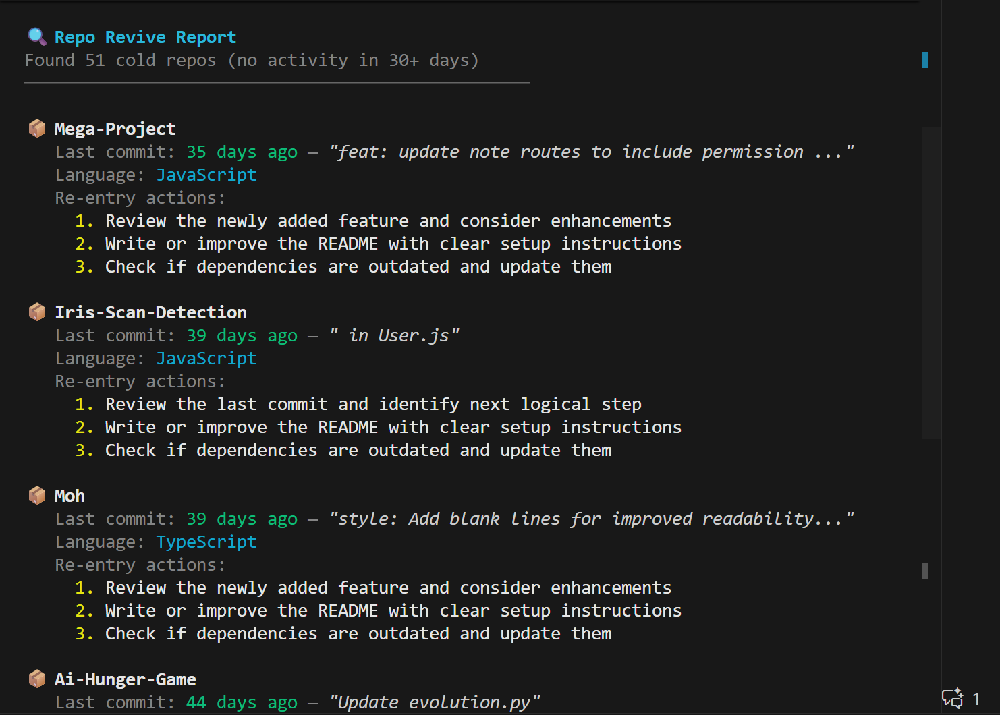

# 🔥 Repo Revive

A CLI tool that analyzes your GitHub repositories and helps you re-engage with abandoned projects. Find your forgotten side projects and get actionable steps to revive them.



---

## ✨ Features

| Feature | Description |
|---------|-------------|
| **Cold Repo Detection** | Finds repos with no commits in 30+ days |
| **Smart Filtering** | Excludes forks and archived repos automatically |
| **Re-entry Briefs** | Generates actionable next steps for each repo |
| **Priority Sorting** | Shows most revivable repos first |
| **Customizable** | Adjust inactivity threshold and result limit |

---

## 🚀 Quick Start

```bash
# Clone the repository
git clone https://github.com/ADITYABHURAN/GitHub-streak-extension.git

# Navigate to the CLI tool
cd GitHub-streak-extension/repo-revive

# Install dependencies
npm install

# Create your .env file with GitHub token
echo "GITHUB_TOKEN=your_token_here" > .env

# Run the tool
npm start
```

---

## 🔑 Getting a GitHub Token

1. Go to [GitHub Settings → Developer Settings → Personal Access Tokens](https://github.com/settings/tokens/new)
2. Generate a new token (classic) with `repo` scope
3. Copy the token and add it to your `.env` file

---

## 📖 Usage

```bash
# Default: 30 days threshold, 5 repos
npm start

# Custom inactivity threshold (60 days)
npm start -- --days 60

# Show more repos
npm start -- --limit 10

# Combine options
npm start -- --days 14 --limit 3
```

---

## 📦 Example Output

```
🔍 Repo Revive Report
Found 12 cold repos (no activity in 30+ days)
──────────────────────────────────────────────────

📦 my-old-project
   Last commit: 45 days ago — "Add user authentication"
   Language: TypeScript
   Description: A REST API for task management
   Re-entry actions:
     1. Review the newly added feature and consider enhancements
     2. Add or improve API endpoints and error handling
     3. Check if dependencies are outdated and update them

📦 another-project
   Last commit: 120 days ago — "WIP: refactor database layer"
   Language: Python
   Re-entry actions:
     1. Continue the work-in-progress from the last session
     2. Write or improve the README with clear setup instructions
     3. Check if dependencies are outdated and update them
```

---

## 🛠️ Tech Stack

| Component | Technology |
|-----------|------------|
| Runtime | Node.js + TypeScript |
| GitHub API | @octokit/rest |
| CLI Framework | Commander.js |
| Terminal Styling | Chalk |
| Environment | dotenv |

---

## 📁 Project Structure

```
repo-revive/
├── src/
│   ├── index.ts        # CLI entry point
│   ├── github.ts       # GitHub API calls
│   ├── analyze.ts      # Cold repo detection logic
│   └── output.ts       # Terminal formatting
├── .env.example        # Template for environment variables
├── .gitignore
├── package.json
└── tsconfig.json
```

---

## 🎯 How It Works

1. **Authenticate** — Uses your GitHub Personal Access Token
2. **Fetch Repos** — Gets all your repositories via GitHub API
3. **Filter** — Removes forks and archived repos
4. **Analyze** — Identifies repos with no recent commits
5. **Generate Briefs** — Creates actionable re-entry steps based on:
   - Last commit message keywords (WIP, fix, add, refactor, etc.)
   - Repository description (API, CLI, web, etc.)
6. **Sort & Display** — Prioritizes recently abandoned over very old repos

---

## 🤝 Contributing

Contributions welcome! Feel free to submit issues and pull requests.

---

## 📄 License

MIT License - Feel free to use and modify!

---

## 💡 Inspiration

- The guilt of abandoned side projects 😅
- Snapchat Streaks 👻
- GitHub Contribution Graph 📊

---

**Stop forgetting your projects. Revive them. 🔥**
